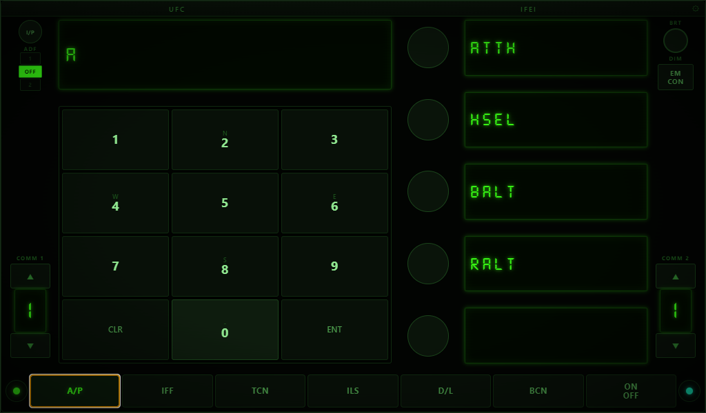
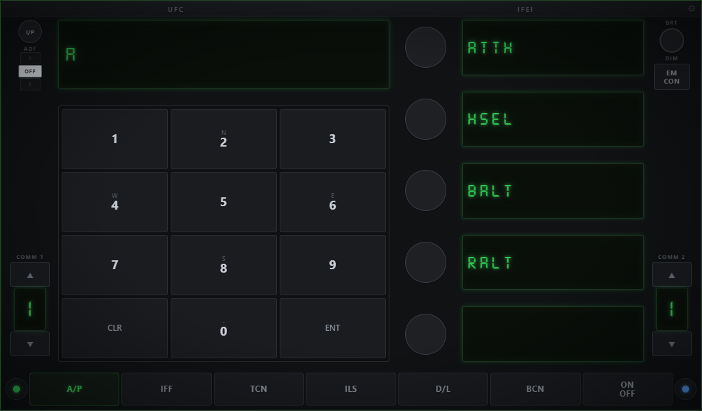
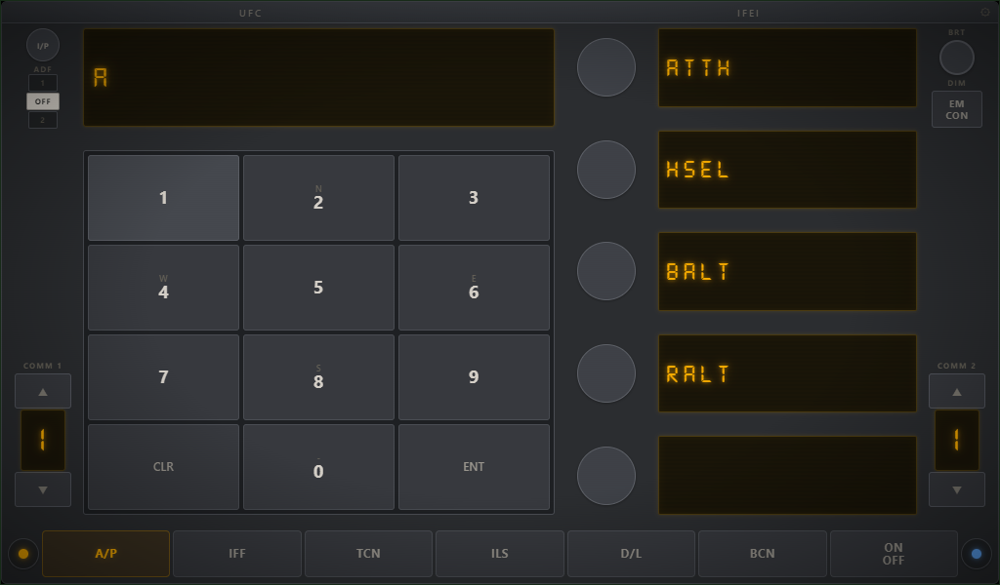

# UFC - DCS World Touchscreen Controller

A touchscreen-optimized Up Front Controller (UFC) for DCS World's F/A-18C Hornet, built with Electron + React. Designed to run on a 7" HDMI touchscreen as a dedicated cockpit panel. But is shoud work on any screen.



## Features

- **Full UFC functionality** - scratchpad, numpad, option select buttons (OSBs), function mode buttons, COMM channel selectors, I/P, ADF, EMCON, and brightness controls
- **Live DCS connection** - communicates with DCS World via TCP bridge and UDP telemetry for real-time display updates
- **Touch optimized** - large button targets, spacing, and layout tuned for 7" (1024x600) touchscreens
- **3 themes** - Stealth (dark), Hornet (amber cockpit), and Viper (fluorescent green)
- **DS-Digital font** - authentic 7-segment LCD display look with neon glow and CRT scanline effects
- **Global hotkeys** - toggle window visibility and trigger UFC commands from any app via configurable hotkeys
- **Always-on-top overlay** - frameless, transparent window that floats over DCS
- **3D-printable mask** - includes a STEP file generator for a physical button overlay that clips onto your screen

## Themes

| Stealth | Hornet | Viper |
|---------|--------|-------|
|  |  |  |

## Getting Started

### Prerequisites

- [Node.js](https://nodejs.org/) (v18+)
- [DCS World](https://www.digitalcombatsimulator.com/) with the F/A-18C module

### Install

```bash
git clone https://github.com/your-username/ufc.git
cd ufc
npm install
```

### Development

```bash
npm run dev
```

This starts the Vite dev server and Electron concurrently with hot reload.

### Production Build

```bash
npm run build
```

Outputs an installer and portable `.exe` to the `release/` folder.

## DCS Setup

On first launch, the app automatically installs Lua export scripts into your DCS Saved Games folder. These scripts enable:

- **TCP command bridge** (port 42072) - sends button presses to DCS
- **UDP telemetry** (port 42070) - receives display data from DCS

Ports are configurable in the settings panel (gear icon in the top bar).

## Settings

Click the gear icon to configure:

- **Window size** - width and height in pixels
- **UDP port** - for receiving telemetry data
- **DCS TCP port** - for sending commands
- **DCS Telemetry port** - for receiving cockpit display state
- **Theme** - Stealth, Hornet, or Viper

## 3D-Printable Mask

A Python script (`generate_mask.py`) generates a STEP file for a thin overlay mask that clips onto a 7" HDMI display (1024x600, 154mm x 86mm active area).

```bash
pip install cadquery
python generate_mask.py
```

This produces `ufc_mask_7inch.step` with:

- Cutouts for all buttons, displays, and controls
- 2mm thick face plate
- Lip on top, left, and right edges to hang on the screen bezel
- Sized for a generic 7" HDMI touchscreen

Open the STEP file in your slicer (PrusaSlicer, Cura) or CAD program (Fusion 360, FreeCAD) to print.
It still needs some work tbh

## Hotkeys

The app includes a PowerShell-based global hotkey listener. Configure key bindings in the settings to:

- Toggle UFC window visibility
- Trigger any UFC button from the keyboard

## Project Structure

```
ufc/
  electron/          Electron main process
    main.js          Window, IPC handlers, DCS bridge
    preload.js       Context bridge API
    settings.js      Persistent settings (JSON)
    UDPListener.js   UDP telemetry receiver
    DCSBridge.js     TCP command sender
  src/
    components/
      UFC.jsx        Main UFC React component
    scss/
      UFC.scss       Styling, themes, animations
    font/
      DS-DIGI.TTF    DS-Digital 7-segment LCD font
  Scripts/           DCS Lua export scripts
  generate_mask.py   STEP file generator for 3D mask 
  screenshots/       App screenshots
```

## License

MIT
